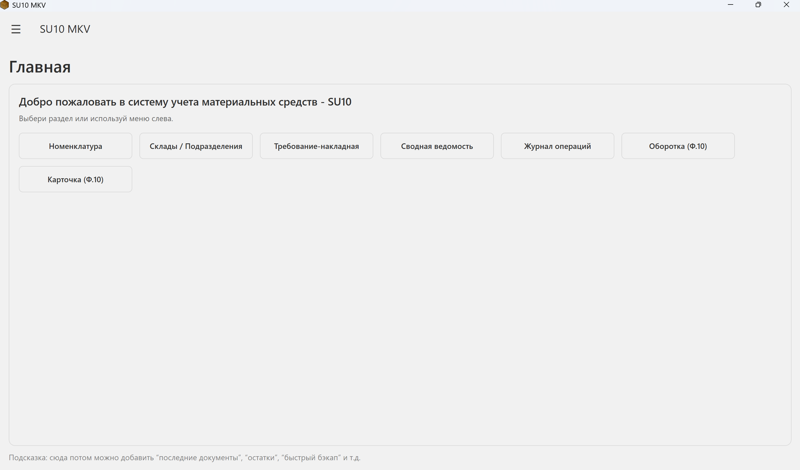
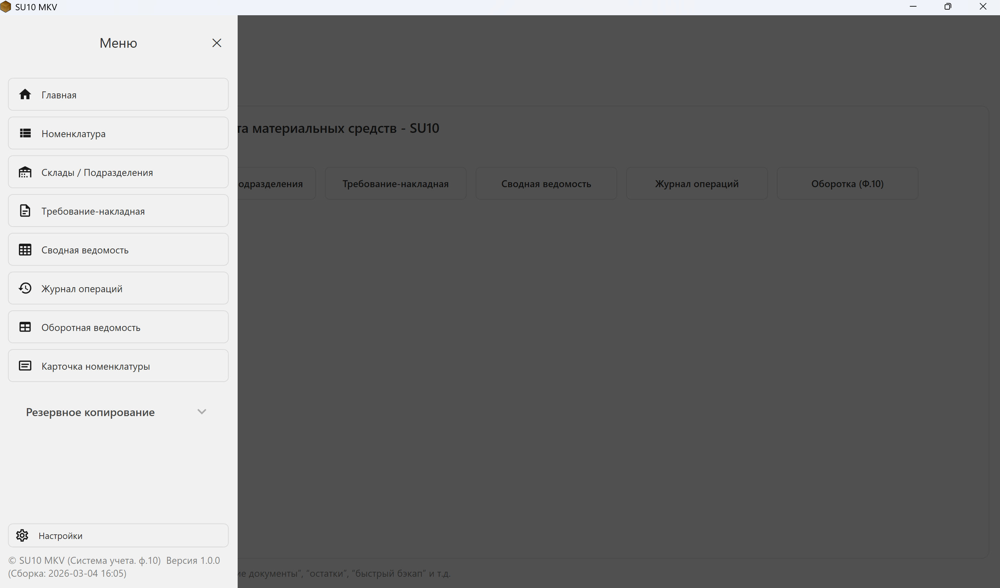

# SU10-MKV
SU10 MKV - Удобная программа для учета материальных средств

## О проекте
Это приложение поможет вам вести учет материальных средств, как на складе так и за организацию в целом. 
Бумажный носитель в 2026 году не так надежен, в этом случае понадобится программы для учета без заморочек, продаж.. и прочих поступлений, строго - приход, расход, остаток. 

## Функции
- Основной экран
- Номенклатура МС
- Подразделения
- Накладные
- Темная тема

## Технологии
- C# + Windows Presentation Foundation
- Windows x64, arm64

## Скриншоты

  
 

